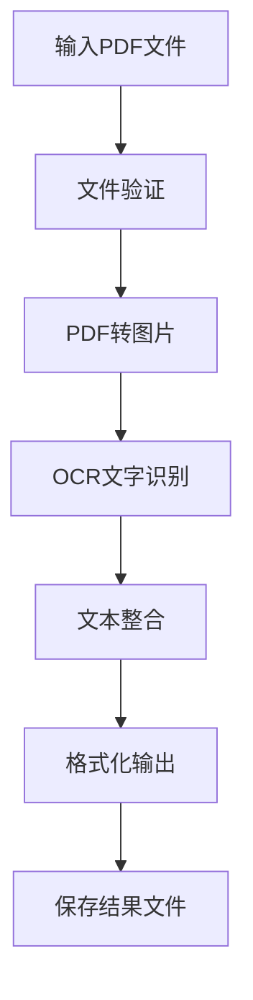

# PDF OCR 文字提取工具产品需求文档

## 1. 产品概述
一个基于OCR技术的命令行工具，用于将图片格式的PDF文档转换为可编辑的文字内容。
- 解决扫描版PDF无法复制文字的问题，提高文档处理效率。
- 主要面向需要处理大量扫描文档的用户，如学生、研究人员、办公人员。
- 提供高精度的文字识别能力，支持中英文混合识别。

## 2. 核心功能

### 2.1 用户角色
本工具为单用户命令行应用，无需角色区分。

### 2.2 功能模块
我们的PDF OCR工具包含以下核心功能：
1. **PDF处理模块**：PDF文件读取、页面提取、图片转换
2. **OCR识别模块**：图片文字识别、多语言支持、识别精度优化
3. **文本输出模块**：文本格式化、文件保存、结果展示
4. **配置管理模块**：参数设置、语言选择、输出格式配置

### 2.3 页面详情
| 功能模块 | 子功能 | 功能描述 |
|----------|--------|----------|
| PDF处理模块 | 文件读取 | 支持PDF文件输入验证、格式检查 |
| PDF处理模块 | 页面转换 | 将PDF页面转换为高质量图片格式 |
| OCR识别模块 | 文字识别 | 使用Tesseract引擎进行文字识别 |
| OCR识别模块 | 语言检测 | 自动检测或手动指定识别语言 |
| 文本输出模块 | 格式化输出 | 保持原文档的段落结构和格式 |
| 文本输出模块 | 文件保存 | 支持TXT、DOCX等多种输出格式 |
| 配置管理模块 | 参数配置 | DPI设置、识别精度、输出路径等 |

## 3. 核心流程
用户使用流程：
1. 用户通过命令行指定PDF文件路径
2. 系统验证文件格式并读取PDF内容
3. 将PDF页面逐页转换为高分辨率图片
4. 对每张图片进行OCR文字识别
5. 整合所有页面的识别结果
6. 格式化文本内容并保存到指定位置
7. 显示处理结果和统计信息

## 4. 用户界面设计
### 4.1 设计风格
- 主色调：终端默认颜色（黑白为主）
- 交互方式：命令行界面，简洁明了
- 字体：等宽字体，便于对齐显示
- 布局风格：线性流程，逐步提示
- 图标样式：使用ASCII字符和简单符号

### 4.2 界面设计概览
| 界面模块 | 显示元素 | UI特点 |
|----------|----------|--------|
| 命令行输入 | 参数提示、帮助信息 | 清晰的参数说明，支持--help选项 |
| 处理进度 | 进度条、当前状态 | 实时显示处理进度和当前操作 |
| 结果输出 | 识别统计、文件路径 | 简洁的结果摘要和文件位置信息 |
| 错误提示 | 错误信息、解决建议 | 友好的错误提示和操作建议 |

### 4.3 响应性
本工具为命令行应用，主要考虑跨平台兼容性（Windows、macOS、Linux）。