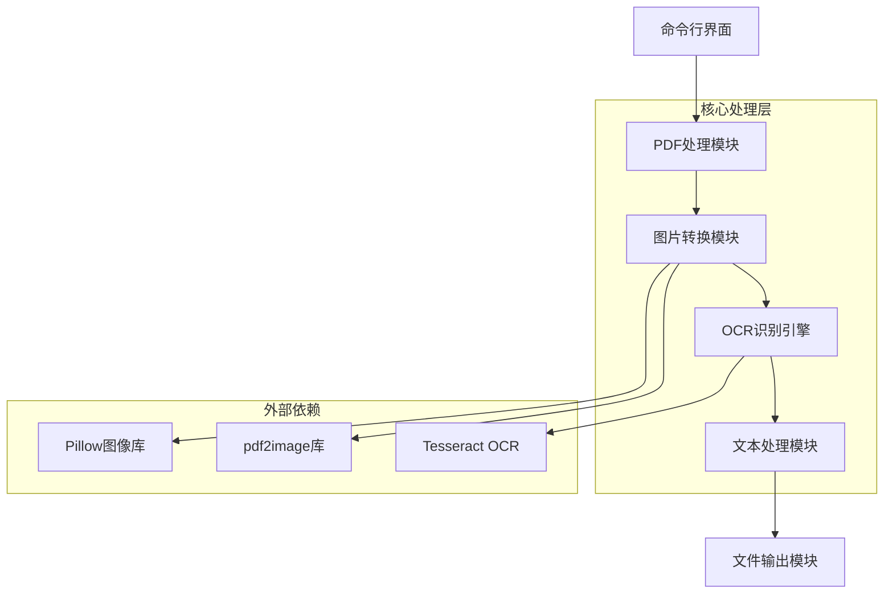
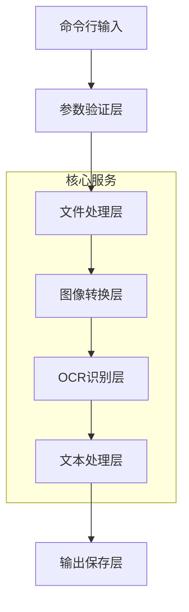
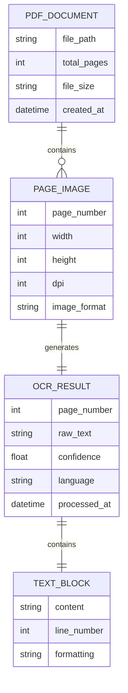

# PDF OCR 文字提取工具技术架构文档

## 1. 架构设计



## 2. 技术描述
- 前端：命令行界面（CLI）使用 Python argparse
- 核心引擎：Python 3.8+ 
- OCR引擎：Tesseract OCR 4.0+
- PDF处理：pdf2image + poppler-utils
- 图像处理：Pillow (PIL)
- 文本处理：内置字符串处理 + python-docx（可选）

## 3. 核心模块定义

| 模块名称 | 功能描述 |
|----------|----------|
| /main.py | 主程序入口，命令行参数解析和流程控制 |
| /pdf_processor.py | PDF文件处理，页面提取和图片转换 |
| /ocr_engine.py | OCR识别核心，文字提取和语言处理 |
| /text_formatter.py | 文本格式化，段落整理和输出格式化 |
| /config.py | 配置管理，参数设置和环境配置 |
| /utils.py | 工具函数，文件操作和错误处理 |

## 4. API定义

### 4.1 核心API

**PDF转换接口**
```python
def convert_pdf_to_images(pdf_path: str, dpi: int = 300) -> List[PIL.Image]
```

参数说明:
| 参数名 | 参数类型 | 是否必需 | 描述 |
|--------|----------|----------|------|
| pdf_path | string | true | PDF文件的完整路径 |
| dpi | int | false | 图片转换分辨率，默认300 |

返回值:
| 参数名 | 参数类型 | 描述 |
|--------|----------|------|
| images | List[PIL.Image] | 转换后的图片对象列表 |

**OCR识别接口**
```python
def extract_text_from_image(image: PIL.Image, lang: str = 'chi_sim+eng') -> str
```

参数说明:
| 参数名 | 参数类型 | 是否必需 | 描述 |
|--------|----------|----------|------|
| image | PIL.Image | true | 待识别的图片对象 |
| lang | string | false | 识别语言，默认中英文 |

返回值:
| 参数名 | 参数类型 | 描述 |
|--------|----------|------|
| text | string | 识别出的文字内容 |

**文本保存接口**
```python
def save_text_to_file(text: str, output_path: str, format: str = 'txt') -> bool
```

参数说明:
| 参数名 | 参数类型 | 是否必需 | 描述 |
|--------|----------|----------|------|
| text | string | true | 要保存的文字内容 |
| output_path | string | true | 输出文件路径 |
| format | string | false | 输出格式，支持txt/docx |

## 5. 服务架构图



## 6. 数据模型

### 6.1 数据模型定义



### 6.2 配置数据结构

**配置文件结构 (config.json)**
```json
{
  "ocr": {
    "language": "chi_sim+eng",
    "dpi": 300,
    "confidence_threshold": 60
  },
  "output": {
    "format": "txt",
    "preserve_formatting": true,
    "output_directory": "./output"
  },
  "processing": {
    "max_workers": 4,
    "temp_directory": "./temp",
    "cleanup_temp": true
  }
}
```

**依赖包配置 (requirements.txt)**
```
pdf2image>=3.1.0
Pillow>=9.0.0
pytesseract>=0.3.10
python-docx>=0.8.11
tqdm>=4.64.0
argparse>=1.4.0
```

**安装脚本说明**
```bash
# 安装Python依赖
pip install -r requirements.txt

# 安装Tesseract OCR引擎
# macOS
brew install tesseract tesseract-lang

# Ubuntu/Debian
sudo apt-get install tesseract-ocr tesseract-ocr-chi-sim

# Windows
# 下载并安装 https://github.com/UB-Mannheim/tesseract/wiki
```